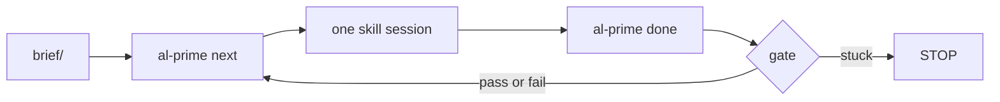

# Agentic Loop Prime

[](LICENSE)
[](https://www.python.org/)

An outer loop that will not let the builder grade its own homework.

You put notes in a brief. Prime names **one** skill. An agent (Cursor by default) does that skill. A file or a process exit decides whether the work counts. Then the next real step, or a stop. `al-prime` never calls a model.



## What it is

Prime is a **goal-loop harness** for building **new** software from a brief. The folder you open is a *studio*: operator notes, run state, and the product tree sit side by side.

`al-prime` owns the outer schedule. It prints a Resume block (which skill to load, what to write, how to close) and records the outcome. The inner agent owns plan, act, observe. The model forgets between sessions. `memory/` does not.

The pipeline is intake, design, build, then an independent verify. Build may edit `app/`. Prove, security, and judge must not. Product git is `app/` only. `memory/` stays beside that repo, never inside it.

A planted `tests_passed: true` does not advance the program. Two fails of the same action stop as `blocked_stagnation`.

## What it is not

Prime is not an agent and not a model wrapper. It does not write your product, talk to an API, or invent the next step. Something that can load a `SKILL.md` and run a CLI does that work. Cursor is the default. Claude Code and VS Code Agent can run the same studio by opening the folder and following Resume.

It is not a tool for reshaping a large existing codebase. You start from notes and an empty `app/`.

It is not a hosted product and not a timer that pokes CI every morning. One program, one feature at a time, until every backlog row is `live` or the loop stops.

## Five-minute try

You need Python 3.12 and [uv](https://docs.astral.sh/uv/). Open the studio folder in Cursor, Claude Code, or VS Code Agent.

```bash
git clone https://github.com/AlessandroAnnini/agentic-loop-prime.git
cd agentic-loop-prime
uv sync --extra dev
uv run al-prime --version
```

Seed a studio in this directory (or pass another path to `init`):

```bash
uv run al-prime init .
printf '%s\n' \
  'Build a tiny todo CLI in Python.' \
  'Add a task, list tasks, and mark one done.' \
  > brief/notes.md
uv run al-prime next --memory memory --brief-dir brief --app-dir app --prompt
```

You will not finish a product in five minutes. You will see the first frame.

## What you will see

`next --prompt` prints a line such as `DELEGATE intake program substep=charter`, then a Resume block: Load, Write, Close. Open that skill under `.agents/skills/` (the same files are also copied to `.claude/skills/` for Claude Code), do only that write, and close the frame:

```bash
uv run al-prime done --memory memory --pass
```

The next `next` is the next real step, not a guess. A second `next` while a lock is open is `STOP transition_open`.

When the charter or a feature brief needs a human, you get `STOP` with a named gate. Sign the file (`**Status:** signed` on the brief, or `charter_signed` in run-state), then `next` again. `--autonomous` auto-signs those gates. It does not skip verify.

Before prove, fill `memory/adr/ADR-0005-technology-stack.md` with `UNIT_TEST_CMD`, `E2E_TEST_CMD`, and `SECURITY_*`. Env exports override the ADR.

`done --pass` on verify runs those commands. Prove stamps `prove.yaml` only on exit 0 with a matching `app/` fingerprint. Security runs `SECURITY_*` and gates the findings report. The harness never writes `**Status:** pass` for you. A failed check reopens a build step.

## Studio

```text
my-studio/
├── memory/           run-state, charter, backlog, ADR-0005, feature logs
├── brief/            your notes (read-only to the agent)
├── app/              product tree and git root
├── AGENTS.md
├── CLAUDE.md
├── CORRECTIONS.md
├── .prime/manifest.yaml
├── .agents/skills/   canonical prime-* plus UX/UI (Resume names these)
└── .claude/skills/   same skills for Claude Code
```

`al-prime init` creates that layout. `al-prime doctor` checks the pin, run-state, skills, commit paths, and ADR commands. `al-prime update` refreshes skills from the kit without wiping `memory/` or `app/` source.

After a feature ships, `al-prime request-change --intent "..."` queues a new slice at design.

## Commands

| Command | Role |
|---|---|
| `init` | Create a studio |
| `next` | Frame the next DELEGATE, HANDOFF, or STOP |
| `done` | Close the open frame |
| `request-change` | Queue a new slice after ship |
| `unattended` | Frame, optionally run `--agent-cmd`, then close |
| `update` | Refresh skills and the kit pin |
| `doctor` | Report studio health |

If you are the agent in the session, the boot protocol is [AGENTS.md](AGENTS.md). How the states and gates fit together, with diagrams: [docs/how-it-works.md](docs/how-it-works.md).

## Unattended turns

Default `unattended` still prints `AGENT_NEEDED` and exits 3. You run one skill, then `done`, then `memory/now/continue.sh`.

`--agent-cmd` is the write. Prime closes. Intake and design pass when the Resume write path is nonempty. Build passes when `app/` changed. Verify fails if `app/` drifted from the build fingerprint; it does not run UNIT/E2E on a mutated tree. That fail clears the lock and reopens build.

```bash
uv run al-prime unattended --memory memory --brief-dir brief --app-dir app \
  --autonomous --agent-cmd 'bash scripts/agent-claude.sh'
```

`scripts/agent-claude.sh` runs `claude -p` and does not call `done`. Charter and brief STOPs stay `PAUSE`. `--autonomous` skips those sign-off gates; it is not a substitute for `--agent-cmd`. VS Code Agent can follow Resume in the folder. It is not this closer.

Each frame writes `memory/now/next-policy.json` (`ALP_POLICY_FILE`). `app_writable` is true only for build. Adapters read that file; Prime does not sandbox the process.

## Tests

```bash
uv run pytest -q
```

## Observability

Traces are optional. The loop runs without a collector.

When `OTEL_EXPORTER_OTLP_ENDPOINT` is set (for example `http://localhost:4318`), Prime exports the spans it already records over OTLP HTTP. `next` and `done` share one W3C `trace_id`. There are no `chat` or token spans. This process does not call a model.

```bash
export OTEL_EXPORTER_OTLP_ENDPOINT=http://localhost:4318
uv run al-prime next --memory memory --brief-dir brief --app-dir app
```

A local Jaeger all-in-one is `bash scripts/start-jaeger.sh`. What we emit and how to read it: [docs/opentelemetry.md](docs/opentelemetry.md).

## Design notes

The control plane is a `python-statemachine` StateChart. The shape of the loop (one framed skill, independent verify, stop on no progress, state on disk) follows the parts list in Addy Osmani's *Loop Engineering*. What we took, and what we left: [docs/addy-osmani.md](docs/addy-osmani.md).

If a page and the code disagree, the code wins.

## License

Copyright Alessandro Annini. Licensed under [AGPL-3.0](LICENSE). If you run a modified version as a network service, you must offer the source. Changes are listed in [CHANGELOG.md](CHANGELOG.md).
