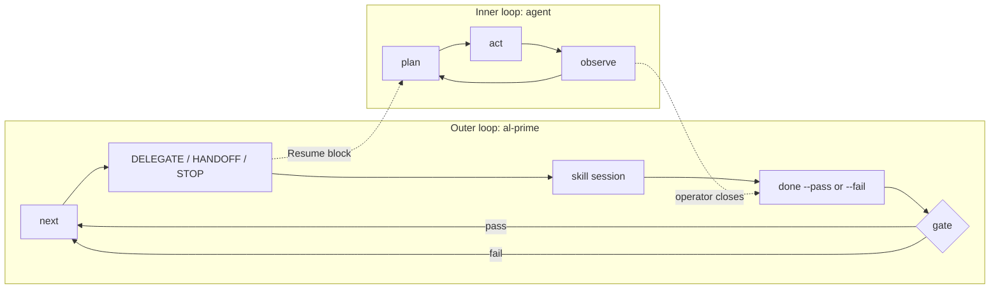
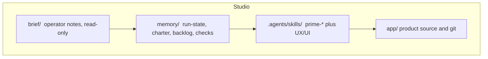
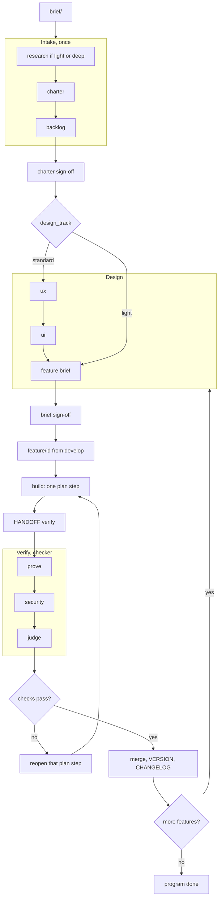
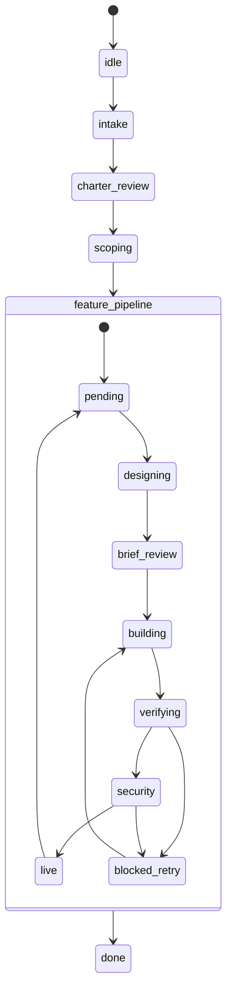
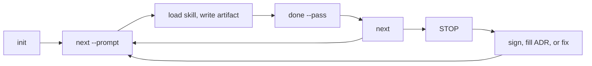

# How Prime works

Prime is an **outer** goal loop. It names one skill, waits for that session to close, then advances only if a mechanical gate agrees. Cursor (or another agent) runs the **inner** loop: plan, act, observe. `al-prime` never calls a model.

The goal is every backlog feature `live`, or a STOP. Not a heartbeat. Not a cron.

## Two loops

`next --prompt` prints a Resume block: which `prime-*` skill to load, what to write, and the close command. The operator (or that skill) runs `done`. A second `next` while a lock is open is `STOP transition_open`.

## Studio

The folder you open (Cursor, Claude Code, or VS Code Agent) is the studio. Three trees sit side by side.

`memory/` is the spine. The model forgets between sessions. The files do not. Product history is `app/` only. Never commit `memory/`, the kit, `.agents/`, or `.claude/`. The same skills are also copied to `.claude/skills/` for Claude Code. Resume names `.agents/skills/`.

## Pipeline

Intake runs once. Each feature then walks design, sign-off, build, an independent verify, and ship. The next feature starts at design, not at the brief folder.

Light track writes `brief.md` only. Standard track writes `ux.md`, then `ui.md`, then the brief. Prime has no functional or technical design files.

Build may edit `app/`. Prove, security, and judge must not.

## Frame and close

One `next` is one frame. The StateChart picks the coarse state. Substeps stay out of the machine.

`done --pass` on build hashes `app/` into `checks/fingerprint.json`. On prove it runs ADR `UNIT_TEST_CMD` and `E2E_TEST_CMD`. On security it runs `SECURITY_*` and then the findings-table gate. On judge it writes a checklist, merges to `develop`, and bumps `VERSION`. `--fail` logs only. Neither outcome is a telemetry error by itself.

Two fails of the same `{skill}:{substep}` become `STOP blocked_stagnation`. `--autonomous` may reopen design once. It still does not skip verify.

## Commands in the loop

`doctor` checks the studio. `update` refreshes skills from the kit. `request-change` queues a new slice after ship. `unattended` without `--agent-cmd` writes `memory/now/` and exits 3 so you can run one skill, `done`, and `continue.sh`. With `--agent-cmd`, the command writes and Prime closes. Verify drift versus the build fingerprint is `DONE fail`, not a stuck lock.

## Where to go next

- [Addy Osmani](addy-osmani.md): why the loop is shaped this way
- [OpenTelemetry](opentelemetry.md): what a frame looks like as traces
