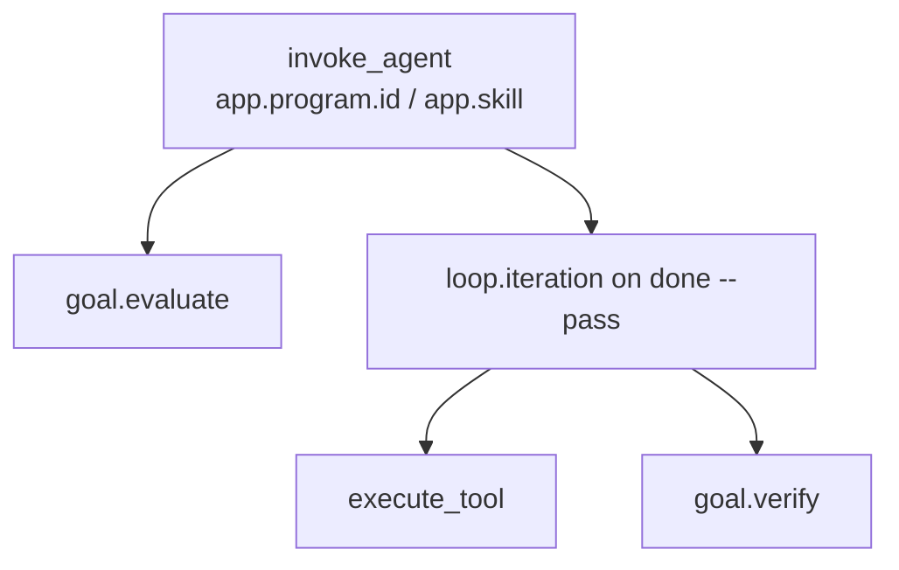

# OpenTelemetry in Prime

Traces answer one question: what did the **outer** loop do, and did the gate agree?

Prime records spans for frames, evaluations, checker runs, and harness tools. It does not record prompts, completions, or tokens. This process does not call a model. There is no `chat` span, and there will not be one until a runner that owns a model client exists.

The inner-loop design (DECIDING / ACTING, `chat`, token totals) assumes this process calls a model. We kept the outer names (`invoke_agent`, `goal.evaluate`, `goal.verify`, `execute_tool`) and left the inner names unimplemented on purpose.

## Role

OpenTelemetry is a listener, not the scheduler. Domain transitions do not import the SDK. `OpenTelemetryListener` attaches to the StateChart and to `next` / `done` / `doctor` / `update`.

Two rules matter more than the exporter:

1. Do not put prompts or tool payloads on spans. Duration is already on the span.
2. Distinguish a **technical error** (exception, missing ADR, timeout) from an **agent outcome** (`goal_not_met`, `blocked_stagnation`, test exit 1). Only the first sets `StatusCode.ERROR`.

Without an endpoint, the SDK is not installed as a global provider. The loop still runs. You just get no export.

## What a frame looks like

`next` starts `invoke_agent` with searchable identity (`app.program.id`, `app.feature.id`, `app.skill`, …). Gate checks emit `goal.evaluate` as children of that root. There is no `loop.iteration` on `next`.

`done` continues the same `trace_id` by reading `lock.traceparent`. On `--pass` it opens `loop.iteration` around the harness (prove, security, git). That duration is gate time, not scheduler think-time.

HANDOFF writes `telemetry.last_traceparent` (there is no lock). The next `next` (first verify DELEGATE) extracts it so those two processes share a parent. Later frames are new roots with the same `app.program.id`.



Example after a prove `--pass`:

```text
invoke_agent                         app.program.id=… app.skill=verify
├── loop.iteration
│   ├── execute_tool                 gen_ai.tool.name=UNIT_TEST_CMD
│   ├── execute_tool                 gen_ai.tool.name=E2E_TEST_CMD
│   └── goal.verify
└── goal.evaluate                    app.eval.name=done.verify
```

`next` and `done` are two processes. The stitch is a W3C `traceparent` on the lock (and `telemetry.last_*` after HANDOFF).

## Spans and attributes

Resource on every export: `service.name=agentic-loop-prime`, `service.version` from the package.

| Span | When | Attributes you can use |
|---|---|---|
| `invoke_agent` | One framed `next` or `done` | `gen_ai.operation.name=invoke_agent`, `app.loop.type=goal`, `app.loop.product=prime`, `app.program.id`, `app.feature.id`, `app.skill`, `app.substep`, `app.transition_id`, `app.program_state`, `app.action.kind`, `app.loop.remaining`, `app.loop.autonomous`, `app.loop.frame_seq`, `app.loop.outcome`, `app.loop.stop_reason` |
| `loop.iteration` | `done --pass` harness only | `app.loop.iteration`, plus `app.skill` / `app.substep` / `app.feature.id` when known |
| `goal.evaluate` | A named gate | `app.eval.name`, `app.eval.passed`, optional `app.eval.score`. Fail also sets `app.loop.outcome=goal_not_met` |
| `goal.verify` | Prove / security / judge close | `app.verification.independent`, `app.verification.result` |
| `execute_tool` | Harness or git or kit tool | `gen_ai.operation.name=execute_tool`, `gen_ai.tool.name`, `app.tool.success`, `app.tool.exit_code`. Failures may set `app.tool.stderr_tail` (~200 chars). No command line. |
| `chat` | Never | Honest gap |

State changes are events on the open run or iteration span: `agent.state.transition` with `app.agent.state.from`, `app.agent.state.to`, `app.agent.trigger`.

### Evaluation names

`app.eval.name` is low cardinality. Common values:

| Name | Meaning |
|---|---|
| `delegate.intake` / `.design` / `.build` / `.verify` | Frame accepted that skill |
| `charter_signed`, `brief_signed`, `design_ready` | Sign-off or artifact gates |
| `intake_artifacts_ready`, `build_complete` | Scheduler thinks the phase can move |
| `prove`, `security` | Checker reports exist |
| `done.intake` / `.design` / `.build` / `.verify` | Close agreed or not |
| `phase_fail.prove` / `.security` / `.judge` | Checker failed; next `next` may reopen build |
| `blocked_stagnation` | Same action failed twice |
| `autonomous_reopen_design` | Autonomous used its one escalate |
| `session_budget` | `--loop-budget` exhausted |
| `program_done` | Every feature `live` |
| `doctor` | Studio health |

### Tool names

`gen_ai.tool.name` is the harness verb, not an LLM tool.

| Name | Meaning |
|---|---|
| `UNIT_TEST_CMD`, `E2E_TEST_CMD` | Prove commands from ADR-0005 or env |
| `SECURITY_SECRETS_CMD`, `SECURITY_SCA_CMD`, `SECURITY_SAST_CMD` | Security scanners |
| `fingerprint` | Hash of `app/` after a build pass |
| `judge` | Mechanical checklist |
| `git.init`, `git.commit`, `git.merge` | Product git on `app/` |
| `reopen.plan_step` | Uncheck a plan step after a checker fail |
| `kit.update`, `kit.doctor` | Studio refresh and health |

A nonzero test or scanner exit is `app.tool.success=false` with that `exit_code` and a short `app.tool.stderr_tail`. It is not `StatusCode.ERROR`. Missing ADR, missing fingerprint, or an unfilled security report after tools passed is a technical close (`ERROR`, lock stays).

Jaeger Search: filter on `app.program.id`, `app.feature.id`, and `app.skill`. One `service.name` (`agentic-loop-prime`).

## What you can learn from the data

With a collector you can answer:

- How many frames ran, and which skill (`delegate.*`, `done.*`).
- Where the loop stopped (`app.loop.stop_reason`, `blocked_stagnation`, `session_budget`).
- Whether verify is independent and whether it passed (`goal.verify`).
- Which harness command failed (`execute_tool` + `app.tool.exit_code`).
- How long a prove or security close took (`loop.iteration` on `done --pass`).
- Whether `next` and `done` are the same attempt (shared `trace_id`).
- Which program and feature a span belongs to (`app.program.id`, `app.feature.id`).

You cannot answer:

- Which tokens were spent, or which model ran.
- What the agent wrote or saw.
- Inner DECIDING / ACTING turns inside Cursor.

Those would be fiction. Use Cursor’s own logs for the inner session.

## How to collect it

Export is OTLP HTTP. The process looks for `OTEL_EXPORTER_OTLP_ENDPOINT` or `OTEL_EXPORTER_OTLP_TRACES_ENDPOINT`. `OTEL_SDK_DISABLED=1` skips install. The default processor is `SimpleSpanProcessor` so a short CLI process exports before it exits. Set `OTEL_BSP_SCHEDULE_DELAY` to switch to `BatchSpanProcessor`. `next` / `done` / `init` / `update` / `doctor` also `force_flush` before return.

```bash
# Jaeger, Tempo, or any OTLP HTTP collector on 4318
export OTEL_EXPORTER_OTLP_ENDPOINT=http://localhost:4318
uv run al-prime next --memory memory --brief-dir brief --app-dir app
uv run al-prime done --memory memory --pass
```

A local Jaeger all-in-one is enough to see the tree. Use the kit script so the UI stays on the light theme (Jaeger otherwise follows OS dark mode):

```bash
bash scripts/start-jaeger.sh
```

Open `http://localhost:16686` and search service `agentic-loop-prime`. One prove close should show `invoke_agent` → `loop.iteration` → `execute_tool` rows for UNIT and E2E.

`unattended` passes the same listener into each in-process `next` and, when `--agent-cmd` is set, into `done`. HANDOFF saves `telemetry.last_traceparent` so the first verify `next` continues that parent. Later frames are new roots with the same `app.program.id`.

Packages: `opentelemetry-api`, `opentelemetry-sdk`, `opentelemetry-exporter-otlp-proto-http`. Attribute names are set by hand. We do not depend on `opentelemetry-semantic-conventions`.

## How this differs from an inner-loop trace

An inner-loop tree is `invoke_agent` → `chat` → `execute_tool` → `chat`, with input and output tokens on each turn. That is correct for a process that owns the model.

Prime’s `next` tree is `invoke_agent` → `goal.evaluate`. Prime’s `done --pass` tree is `invoke_agent` → `loop.iteration` → `execute_tool` / `goal.verify`. `execute_tool` here means pytest, a scanner, git, or doctor, not `filesystem.read`. Same span name, different owner.

If this page and the code disagree, the code wins.
